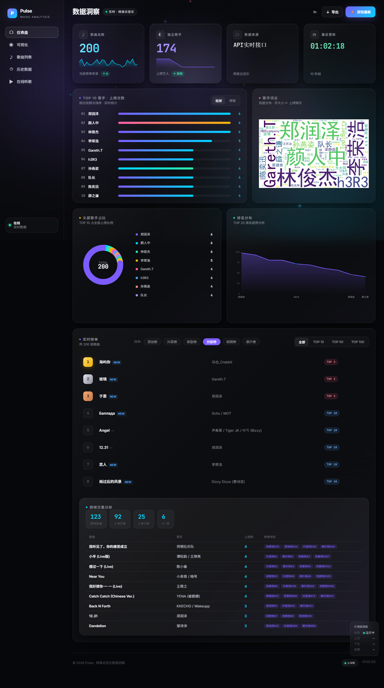

# MusicAnalysis-Work

一个采用 Apple Music 风格界面的网易云音乐榜单分析与在线播放项目。它支持多榜单浏览、搜索、收藏、歌词、播放队列、历史趋势与临时公网分享。




## 主要功能

- 12 个官方榜单动态加载：热歌、飙升、新歌、原创、古典、电音、说唱、ACG、韩语、欧美与日语榜单
- Apple Music 风格的响应式页面，桌面端和手机端均可使用
- 播放、暂停、上一首、下一首、顺序播放、随机播放和单曲循环
- 使用榜单原始歌曲 ID 匹配音源，并按 320/192/128/96 kbps 合法降级重试
- 批量检测歌曲可播放性，可一键只显示当前可播放歌曲
- 明确区分 VIP、需单独购买、版权不可用、下架和服务暂时不可用
- 搜索后可返回原榜单，播放时自动跳过已确认不可用的歌曲
- SQLite 历史快照、排名变化与定时更新
- Cloudflare Quick Tunnel 临时公网分享

> 本项目不会绕过平台会员或版权限制。VIP、付费、地区限制或已下架歌曲会在界面中标记并禁用；实际可播放性以平台接口当前返回结果为准。

## 快速开始（Windows）

1. 安装 Python 3.8 或更高版本，并确保 `python` 已加入 PATH。
2. 安装依赖：

   ```powershell
   python -m pip install -r requirements.txt
   ```

3. 双击 `start.bat`，或运行：

   ```powershell
   powershell -ExecutionPolicy Bypass -File .\MusicAnalysis-Start.ps1
   ```

脚本会启动 Flask、按需下载 `cloudflared`，并打开最新播放器页面：

- 本地播放器：<http://127.0.0.1:5000/player?ui=apple-music-v8>
- 临时公网地址：启动后显示在窗口中，同时写入 `public_url.txt`

停止服务可双击 `stop.bat`，或运行 `MusicAnalysis-Stop.ps1`。

## 开发与测试

项目使用 `src` 布局。在仓库根目录执行：

```powershell
$env:PYTHONPATH = "$PWD\src"
python -m pytest -q
```

主要目录：

- `app.py`：Flask API 与网页入口
- `src/music_analytics/`：榜单抓取、音源解析、历史记录和调度逻辑
- `templates/music_player.html`：播放器页面
- `static/player-core.js`：全局播放状态与控制逻辑
- `tests/`：自动化测试

## 使用说明

- Quick Tunnel 地址是临时地址，电脑、Flask 和 `cloudflared` 必须保持运行。
- 平台接口可能随时间调整；遇到临时服务错误时可以稍后重试。
- `.vip_session.json`、运行日志、PID、临时公网地址和本地历史数据库均已加入 `.gitignore`，不会上传到 GitHub。
